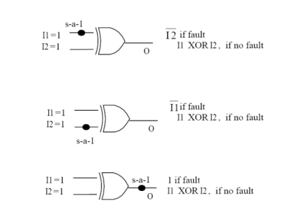
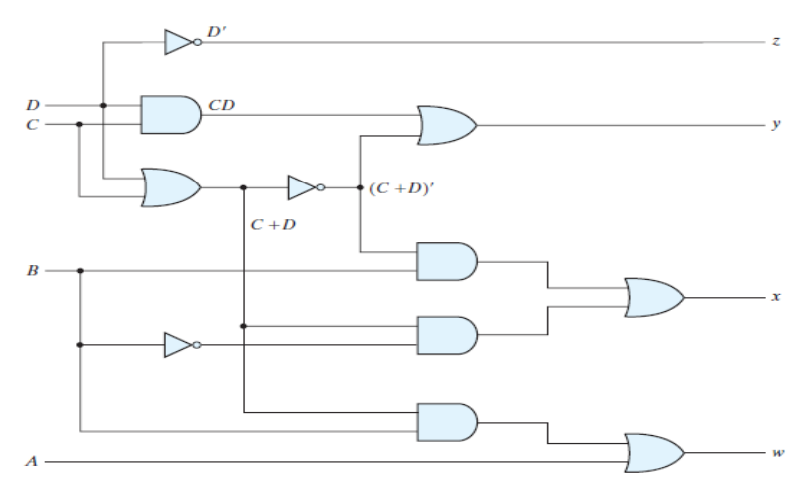

### Introduction

### Binary Coded Decimal (BCD)

BCD stands for Binary Coded Decimal. It is a method to convert decimal numbers to a binary form. In this representation, each digit in the decimal number system is represented by a fixed number of bits (usually four or eight). It is weighted in the form of 8-4-2-1. Assuming four bit representation, the BCD code for each digit as shown in Table 1.

<table class="center" >
    <tr>
      <th>Decimal</th>
      <th colspan="4">Binary (BCD)</th>
    </tr>
    <tr>
      <th></th>
      <th>8</th>
      <th>4</th>
      <th>2</th>
      <th>1</th>
    </tr>
    <tr>
      <td>0</td>
      <td>0</td>
      <td>0</td>
      <td>0</td>
      <td>0</td>
    </tr>
    <tr>
      <td>1</td>
      <td>0</td>
      <td>0</td>
      <td>0</td>
      <td>1</td>
    </tr>
    <tr>
      <td>2</td>
      <td>0</td>
      <td>0</td>
      <td>1</td>
      <td>0</td>
    </tr>
    <tr>
      <td>3</td>
      <td>0</td>
      <td>0</td>
      <td>1</td>
      <td>1</td>
    </tr>
    <tr>
      <td>4</td>
      <td>0</td>
      <td>1</td>
      <td>0</td>
      <td>0</td>
    </tr>
    <tr>
      <td>5</td>
      <td>0</td>
      <td>1</td>
      <td>0</td>
      <td>1</td>
    </tr>
    <tr>
      <td>6</td>
      <td>0</td>
      <td>1</td>
      <td>1</td>
      <td>0</td>
    </tr>
    <tr>
      <td>7</td>
      <td>0</td>
      <td>1</td>
      <td>1</td>
      <td>1</td>
    </tr>
    <tr>
      <td>8</td>
      <td>1</td>
      <td>0</td>
      <td>0</td>
      <td>0</td>
    </tr>
    <tr>
      <td>9</td>
      <td>1</td>
      <td>0</td>
      <td>0</td>
      <td>1</td>
    </tr>
  </table>

Table 1 : Decimal to BCD conversion

### Excess-3 code (XS-3)

The main advantage of the BCD system over regular binary code is that it is fast and efficient, as it is easier to encode and decode decimal values to BCD code. However, it occupies more memory as compared to binary code. The excess-3 code (XS-3) is a non-weighted code, used to represent decimal systems in binary forms. It is obtained by adding 011 (3) to each value in the BCD system. Assuming four-bit representation, the XS-3 code for each digit is shown in Table 2.

 <table style = "align-content: center; width:  100%;">
  <tr>
    <th>Decimal</th>
    <th colspan="4">Binary (BCD)</th>
    <th>Excess-3 Code</th>
  </tr>
  <tr>
    <th></th>
    <th>8</th>
    <th>4</th>
    <th>2</th>
    <th>1</th>
    <th></th>
  </tr>
  <tr>
    <td>0</td>
    <td>0</td>
    <td>0</td>
    <td>0</td>
    <td>0</td>
    <td>0011</td>
  </tr>
  <tr>
    <td>1</td>
    <td>0</td>
    <td>0</td>
    <td>0</td>
    <td>1</td>
    <td>0100</td>
  </tr>
  <tr>
    <td>2</td>
    <td>0</td>
    <td>0</td>
    <td>1</td>
    <td>0</td>
    <td>0101</td>
  </tr>
  <tr>
    <td>3</td>
    <td>0</td>
    <td>0</td>
    <td>1</td>
    <td>1</td>
    <td>0110</td>
  </tr>
  <tr>
    <td>4</td>
    <td>0</td>
    <td>1</td>
    <td>0</td>
    <td>0</td>
    <td>0111</td>
  </tr>
  <tr>
    <td>5</td>
    <td>0</td>
    <td>1</td>
    <td>0</td>
    <td>1</td>
    <td>1000</td>
  </tr>
  <tr>
    <td>6</td>
    <td>0</td>
    <td>1</td>
    <td>1</td>
    <td>0</td>
    <td>1001</td>
  </tr>
  <tr>
    <td>7</td>
    <td>0</td>
    <td>1</td>
    <td>1</td>
    <td>1</td>
    <td>1010</td>
  </tr>
  <tr>
    <td>8</td>
    <td>1</td>
    <td>0</td>
    <td>0</td>
    <td>0</td>
    <td>1011</td>
  </tr>
  <tr>
    <td>9</td>
    <td>1</td>
    <td>0</td>
    <td>0</td>
    <td>1</td>
    <td>1100</td>
  </tr>
</table>

Table 2 : Decimal to XS-3 conversion

The most significant advantage of XS-3 code is that it is self-complementary i.e. the corresponding 9's complement in the decimal system can be obtained by interchanging the 0’s and 1's in the XS-3 code. This makes it easier to overcome the shortcomings encountered during arithmetic operations.

### Stuck At Faults

A stuck-at fault (SAF) is a logic-level fault. Stuck at faults occur when a line is permanently stuck to Vdd or ground giving a faulty output. This line may be an input or output to any gate. Also this fault can be single or multiple stuck at faults.

There are two kinds of SAF:

1.   Stuck at 0
2.   Stuck at 1

When a signal, or gate output, is stuck at a 0 or 1 value, independent of the inputs to the circuit, the signal is said to be "stuck at" and the fault model used to describe this type error is called a "stuck at fault model".

A circuit with n lines can have 3n-1 possible stuck line combinations; each line can be: S-A-1, S-A-0, or fault-free.

Figure 1: Examples of Stuck At 1 faults for XOR gate:

### BCD to Excess-3

A BCD digit can be converted to it's corresponding Excess-3 code by simply adding 3 to it. Let A, B, C and D be the input bits and W, X, Y and Z be the output bits. Then the truth table for the conversion from BCD to Excess-3 is shown in Table 3.

 <table text-align="center" width="250">
                <tr>
                  <th colspan="4">BCD Code (Input)</th>
                  <th colspan="4">Excess-3 Code (Output)</th>
                </tr>
                <tr>
                  <th>A</th>
                  <th>B</th>
                  <th>C</th>
                  <th>D</th>
                  <th>W</th>
                  <th>X</th>
                  <th>Y</th>
                  <th>Z</th>

</tr>
                <tr>
                  <td>0</td>
                  <td>0</td>
                  <td>0</td>
                  <td>0</td>
                  <td>0</td>
                  <td>0</td>
                  <td>1</td>
                  <td>1</td>                  
                </tr>
                <tr>
                  <td>0</td>
                  <td>0</td>
                  <td>0</td>
                  <td>1</td>
                  <td>0</td>
                  <td>1</td>
                  <td>0</td>
                  <td>0</td>                  
                </tr>
                <tr>
                  <td>0</td>
                  <td>0</td>
                  <td>1</td>
                  <td>0</td>
                  <td>0</td>
                  <td>1</td>
                  <td>0</td>
                  <td>1</td>                  
                </tr>
                <tr>
                  <td>0</td>
                  <td>0</td>
                  <td>1</td>
                  <td>1</td>
                  <td>0</td>
                  <td>1</td>
                  <td>1</td>
                  <td>0</td>                  
                </tr>
                <tr>
                  <td>0</td>
                  <td>1</td>
                  <td>0</td>
                  <td>0</td>
                  <td>0</td>
                  <td>1</td>
                  <td>1</td>
                  <td>1</td>                  
                </tr>
                <tr>
                  <td>0</td>
                  <td>1</td>
                  <td>0</td>
                  <td>1</td>
                  <td>1</td>
                  <td>0</td>
                  <td>0</td>
                  <td>0</td>                  
                </tr>
                <tr>
                  <td>0</td>
                  <td>1</td>
                  <td>1</td>
                  <td>1</td>
                  <td>1</td>
                  <td>0</td>
                  <td>1</td>
                  <td>0</td>                  
                </tr>
                <tr>
                  <td>1</td>
                  <td>0</td>
                  <td>0</td>
                  <td>0</td>
                  <td>1</td>
                  <td>0</td>
                  <td>1</td>
                  <td>1</td>                  
                </tr>
                <tr>
                  <td>1</td>
                  <td>0</td>
                  <td>0</td>
                  <td>1</td>
                  <td>1</td>
                  <td>1</td>
                  <td>0</td>
                  <td>0</td>                  
                </tr>
                <tr>
                  <td>1</td>
                  <td>0</td>
                  <td>1</td>
                  <td>0</td>
                  <td>X</td>
                  <td>X</td>
                  <td>X</td>
                  <td>X</td>                  
                </tr>
                <tr>
                  <td>1</td>
                  <td>0</td>
                  <td>1</td>
                  <td>1</td>
                  <td>X</td>
                  <td>X</td>
                  <td>X</td>
                  <td>X</td>                  
                </tr>
                <tr>
                  <td>1</td>
                  <td>1</td>
                  <td>0</td>
                  <td>0</td>
                  <td>X</td>
                  <td>X</td>
                  <td>X</td>
                  <td>X</td>                  
                </tr>
                <tr>
                  <td>1</td>
                  <td>1</td>
                  <td>0</td>
                  <td>1</td>
                  <td>X</td>
                  <td>X</td>
                  <td>X</td>
                  <td>X</td>                  
                </tr>
                <tr>
                  <td>1</td>
                  <td>1</td>
                  <td>1</td>
                  <td>0</td>
                  <td>X</td>
                  <td>X</td>
                  <td>X</td>
                  <td>X</td>                  
                </tr>
                <tr>
                  <td>1</td>
                  <td>1</td>
                  <td>1</td>
                  <td>1</td>
                  <td>X</td>
                  <td>X</td>
                  <td>X</td>
                  <td>X</td>                  
                </tr>  
              </table>

Table 3 : BCD to Excess-3 Code conversion
 

From the truth table above, we draw the K-Maps for each of the output variables W, X, Y and Z.

 

The minimized expressions for the outputs are:

W=A+BC+BD

X= ~ BC + ~ BD + B~ C~ D

Y=CD+ ~ C ~ D

Z= ~D

Figure 2: Logic diagram for BCD-to-excess-3 code converter

